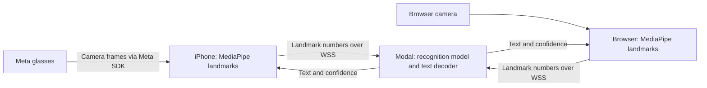

# Hand Wave

Sign recognition for web and iOS, backed by a small Python inference service.

[Watch the demo on YouTube](https://youtu.be/KzZ0YsMSmO8)

## Setup

Requirements: pnpm 10.33+, Node 22+, Python 3.11/3.12, uv, and moon.

```sh
cp .env.example .env
pnpm install
uv sync --project apps/inference
```

Don't forget to set `VITE_INFERENCE_URL` in `.env`.

## Compute and network boundaries

Both clients use local landmark detection and cloud sign recognition. "Cloud-only"
refers to the sign-recognition model, not to all machine learning in the app.



- **Device boundary:** MediaPipe converts images to hand and pose landmarks on the
  client. Camera images are not sent to the inference API. Landmark data still
  represents the user's movements; it is not anonymous by definition.
- **Service boundary:** Each client connects directly to the Python service on
  Modal. `handwave.sh` serves the web application on Vercel; it does not proxy
  recognition requests. This avoids an extra network hop and keeps the model
  runtime separate from web hosting.
- **Session boundary:** `/v1/stream` uses the `handwave.v1` WebSocket protocol.
  The service keeps a rolling landmark window and recognition state per socket.
  On reconnect, the client sends its active window again. A socket is not a user
  account or a durable session.

### What the inference URL means

The URL is the public address of that Python service. It is deployment
configuration, not a credential or a switch between local and cloud inference.

| Client | Build setting | Where it is used |
| --- | --- | --- |
| iOS | `HANDWAVE_INFERENCE_URL` | Xcode writes `HandWaveInferenceURL` into the app's Info.plist; `InferClient` reads it. |
| Web | `VITE_INFERENCE_URL` | Vite includes the value in the browser bundle. |

The production inference address is
`https://sinarck--hand-wave-inference.modal.run`. Clients convert `https` to `wss`
for streaming. The value must name the inference service, not the website.
An iOS Debug build can use a local development server; a physical phone needs
that server's LAN address. Release uses the production service. The spelling
`https:/$()/...` in an Xcode configuration expands to `https://...`; it prevents
Xcode from treating `//` as a comment.

### Current limits

This split keeps image processing close to the camera and lets both clients use
the same recognition model and decoder. It still requires an internet connection.
Modal has no configured minimum warm capacity, so a cold start can delay the first
result. Client deadlines bound the wait; they do not make the server start faster.

The inference API currently has no application authentication or per-user quota.
Its CORS configuration controls browser HTTP access, not API authorization or
WebSocket access. Public release needs an explicit access and cost-control policy.
A shared secret embedded in either client would not provide that boundary.

On-device sign-recognition experiments are isolated on `dev/on-device-inference`.

## Development

```sh
pnpm dev
```

## Research Credits

- [Questure Tracker](https://github.com/tyleryzw/Questure_Tracker)
- [MiCT-RANet for ASL Fingerspelling](https://github.com/fmahoudeau/MiCT-RANet-ASL-FingerSpelling)
- [A Two-Stream Neural Network for Pose-Based Handshape Recognition in American Sign Language](https://link.springer.com/chapter/10.1007/978-3-031-44237-7_29)
- [Mixed 3D/2D Convolutional Tube for Human Action Recognition](https://www.microsoft.com/en-us/research/uploads/prod/2018/05/Zhou_MiCT_Mixed_3D2D_CVPR_2018_paper.pdf)
- [Fingerspelling Recognition in the Wild with Iterative Visual Attention](https://arxiv.org/pdf/1908.10546.pdf)
- [FSBoard: Over 3 million characters of ASL fingerspelling collected via smartphones](https://arxiv.org/abs/2407.15806)
