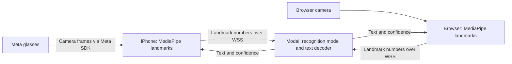

# Hand Wave

Sign recognition for web and iOS, backed by a small Python inference service.

[Watch the demo on YouTube](https://youtu.be/KzZ0YsMSmO8)

## Setup

Requirements: pnpm 10.33+, Node 22+, Python 3.11/3.12, uv, moon, and Git LFS.

```sh
git lfs install
git lfs pull
pnpm install
uv sync --project apps/inference --group deploy
```

Authenticate Modal once with `uv run --project apps/inference --group deploy modal setup`.
The workspace needs a `dev` environment, created once with
`uv run --project apps/inference --group deploy modal environment create dev`.

## Compute and network boundaries

Both clients use local landmark detection and cloud sign recognition. "Cloud-only"
refers to the sign-recognition model, not to all machine learning in the app.



- **Device boundary:** MediaPipe converts images to hand and pose landmarks on the
  client. Camera images are not sent to the inference API. Landmark data still
  represents the user's movements; it is not anonymous by definition.
- **Service boundary:** Each client connects directly to the Python service on
  Modal. `handwave.sh` serves the web application on Vercel; it does not proxy
  recognition requests. This avoids an extra network hop and keeps the model
  runtime separate from web hosting.
- **Session boundary:** `/v1/stream` uses the `handwave.v1` WebSocket protocol.
  The service keeps a rolling landmark window and recognition state per socket.
  On reconnect, the client sends its active window again. A socket is not a user
  account or a durable session.

### What the inference URL means

The URL is the public address of that Python service. It is deployment
configuration, not a credential or a switch between local and cloud inference.

| Client | Build setting | Where it is used |
| --- | --- | --- |
| iOS | `HANDWAVE_INFERENCE_URL` | Xcode writes `HandWaveInferenceURL` into the app's Info.plist; `InferClient` reads it. |
| Web | `VITE_INFERENCE_URL` | Vite includes the value in the browser bundle. |

The development launcher obtains its URL from Modal and writes the ignored
`apps/mobile/Configurations/DebugEndpoint.xcconfig`. It supplies the same URL to
Vite through its process environment. Debug has no production default. The
launcher removes the generated setting when it stops; already-built Debug apps
can reconnect to the same development URL after a restart.

The release workflow creates a backend named for the full Git commit and writes
`ReleaseEndpoint.xcconfig` from the verified deployment. The web build receives
that exact URL too. Credentials remain separate in `HandWave.xcconfig`; that file
cannot override either generated endpoint. The spelling `https:/$()/...` in an
Xcode configuration expands to `https://...` without starting a comment.

### Current limits

This split keeps image processing close to the camera and lets both clients use
the same recognition model and decoder. It still requires an internet connection.
The development launcher keeps one container warm while running. Release backends
can scale to zero when idle, so a cold start can delay the first result. Client
deadlines bound the wait; they do not make the server start faster.

The inference API currently has no application authentication or per-user quota.
Its CORS configuration controls browser HTTP access, not API authorization or
WebSocket access. Public release needs an explicit access and cost-control policy.
A shared secret embedded in either client would not provide that boundary.

On-device sign-recognition experiments are isolated on `dev/on-device-inference`.

## Development

```sh
pnpm dev
```

This command generates the contract, runs `modal serve` in the isolated `dev`
environment, verifies a real recognition request, configures iOS Debug, and starts
Vite. Code changes use Modal's native hot reload. Each Mac/checkout gets a stable,
separate development URL. No LAN addresses or copied URLs are needed.

For iOS alone, use `pnpm dev:mobile`, then open the Xcode workspace and press Run.
Keep the command running. Ctrl-C stops the web server and temporary Modal app and
removes generated endpoint settings. If development is not running, Debug shows
an error instead of connecting to production. These endpoints are reachable over
the internet; `dev` isolation does not make them authenticated.

## Testing

Run `pnpm test` for the real backend, production browser app, and native client
suite. Each run saves repeatable evidence under `artifacts/e2e`, including
protocol transcripts, browser traces/video, native result bundles, source
identity, and SHA-256 checksums. See [the testing policy and commands](tests/README.md)
for setup, retained isolated regressions, and physical-device coverage gaps.

## Releases

The **Release** GitHub workflow is manually started from `main`. Merging runs CI;
it does not publish a backend, website, or TestFlight build. Vercel Git automatic
deployments are disabled so they cannot bypass paired verification.

The workflow:

1. Generates and tests the shared contract, backend, web app, and iOS app.
2. Creates or reuses a backend in Modal's `main` environment named for this exact
   commit. An existing release backend is verified and reused, never overwritten.
3. Checks its build ID, WebSocket handshake, recognition, and reset behavior.
4. Builds the website and iOS app with that backend URL, and runs the actual iOS
   client against it before publishing.
5. Uploads the iOS artifact to TestFlight, then publishes the prebuilt website.

The backend's address is part of each client build. Older installed clients keep
using their matching backend when a new release is prepared. Retire a backend
only when its clients are no longer supported. Retained idle backends can scale
to zero. Failed candidates do not redirect existing clients.

This coordinates artifacts and verification; Apple and Vercel publication is
not one transaction. If website publication fails after TestFlight succeeds,
those new iOS users still have their matching backend. Rerunning the workflow
reuses the verified backend and rebuilds clients from the same commit.

Before the first coordinated release, configure `VERCEL_TOKEN` as a secret and
`VERCEL_ORG_ID` / `VERCEL_PROJECT_ID` as variables in the existing `testflight`
GitHub environment. The existing Apple signing credentials remain there. Modal
credentials remain repository secrets. No Modal or Vercel management token is
included in a client build.

## Research Credits

- [Questure Tracker](https://github.com/tyleryzw/Questure_Tracker)
- [MiCT-RANet for ASL Fingerspelling](https://github.com/fmahoudeau/MiCT-RANet-ASL-FingerSpelling)
- [A Two-Stream Neural Network for Pose-Based Handshape Recognition in American Sign Language](https://link.springer.com/chapter/10.1007/978-3-031-44237-7_29)
- [Mixed 3D/2D Convolutional Tube for Human Action Recognition](https://www.microsoft.com/en-us/research/uploads/prod/2018/05/Zhou_MiCT_Mixed_3D2D_CVPR_2018_paper.pdf)
- [Fingerspelling Recognition in the Wild with Iterative Visual Attention](https://arxiv.org/pdf/1908.10546.pdf)
- [FSBoard: Over 3 million characters of ASL fingerspelling collected via smartphones](https://arxiv.org/abs/2407.15806)
